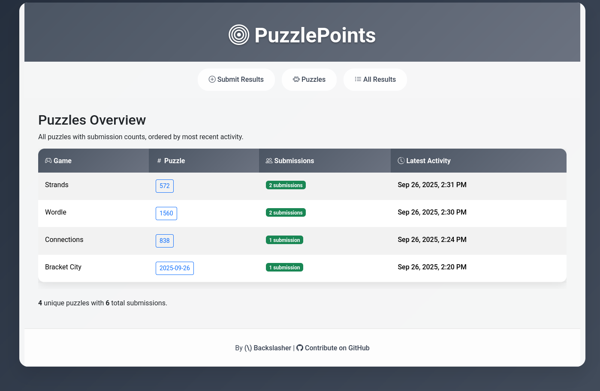

# PuzzlePoints
Post your puzzle scores and compare with your friends

## Usage
Post your puzzle result (from the puzzle's "share" function), compare with others.

## The nitty gritty
Uses PHP (8.3) with Doctrine for DB stuff.
Backend is MySQL.
Frontend is Bootstrap with sprinkles of JS.

Everything was vibe-coded in Claude Code.

## Contributions
Feel free to submit a PR.
Local serving can be done with `make serve`.
